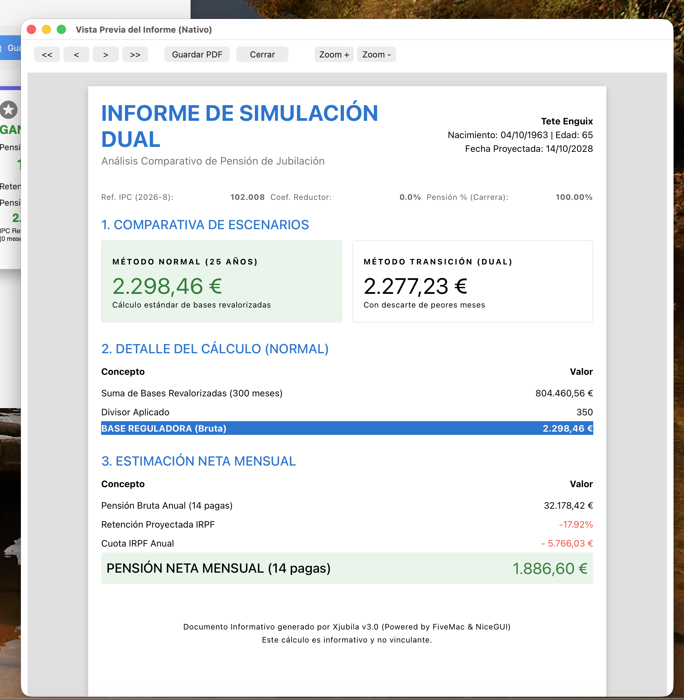
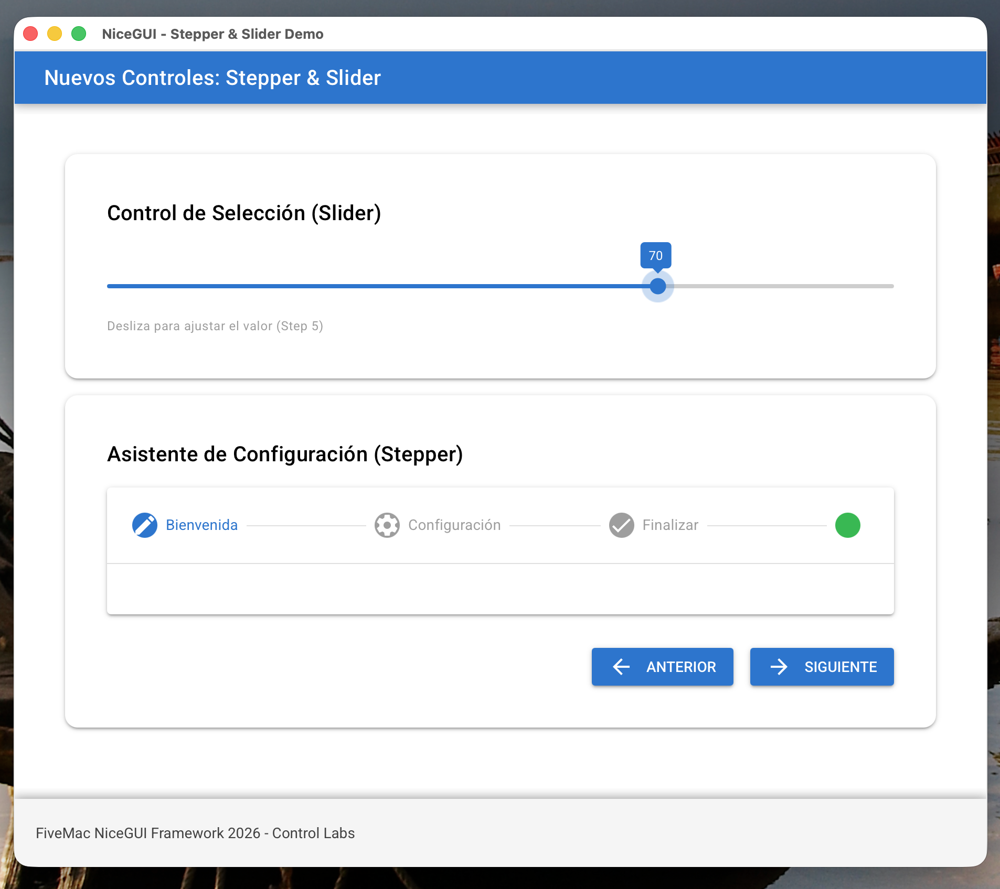
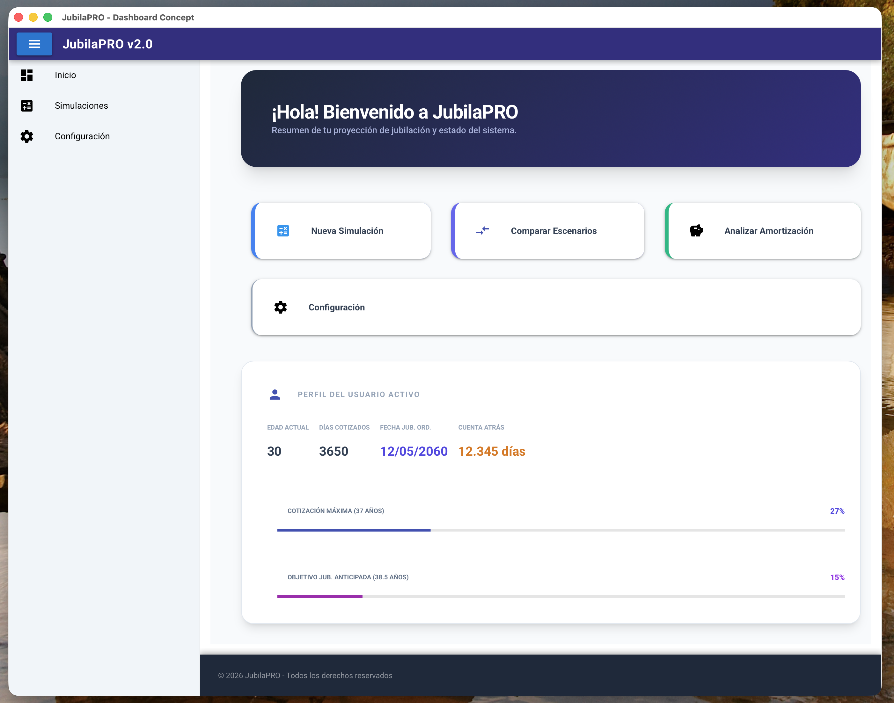
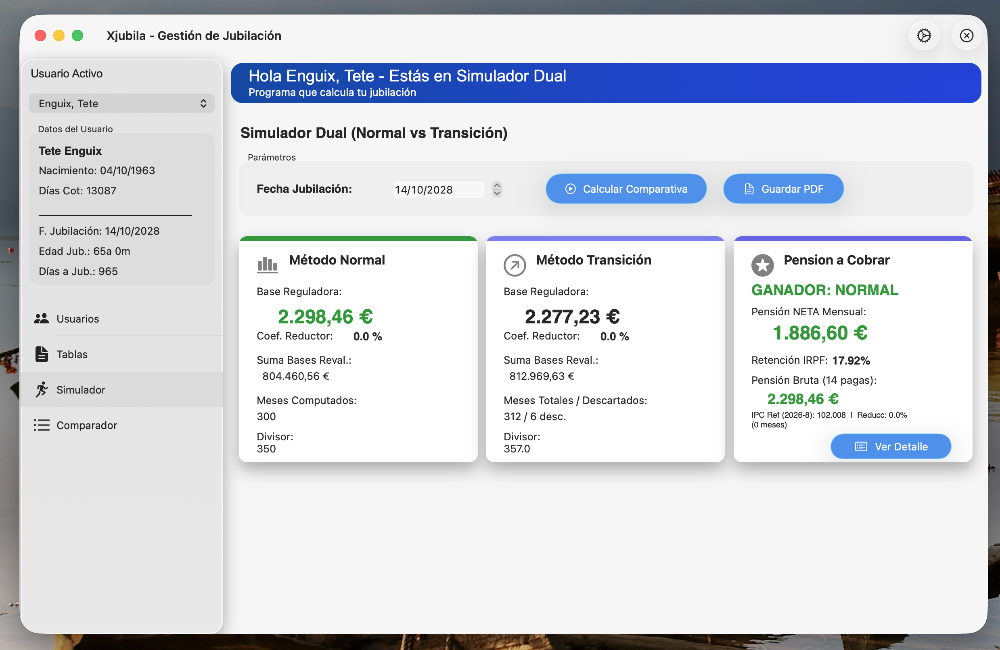
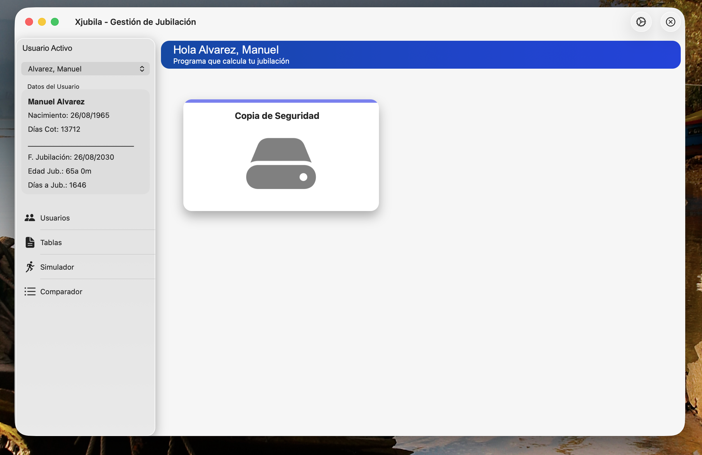

# Frameworks Híbridos

## NiceGUI (Web reactiva local)
FiveMac introduce un puente pionero hacia NiceGUI (basado en Vue.js y Quasar) cargado sobre WebView nativos. Proporciona comandos al estilo xBase para crear interfaces modernas y de aspecto "Dashboard".
- Renderizados responsivos e interacción cliente/servidor directa.
- Controles de tabla de alta capacidad (`TNiceTable`) y Tarjetas de información analítica.

👉 **[Ver Guía de Controles NiceGUI](06b_NiceGUI_Controles.md)**

### Ejemplos Visuales (NiceGUI)

## SwiftUI
Integración del framework más moderno de Apple en Harbour.
Permite definir estructuras declarativas (`TSwiftVStack`, `TSwiftList`) con diseño Glassmorphism, y aplicar actualizaciones "Batch" (lotes de JSON precompilados) para un rendimiento brutal en cientos de celdas.

👉 **[Ver Guía de Controles SwiftUI](06a_SwiftUI_Controles.md)**

### Ejemplos Visuales (SwiftUI)

